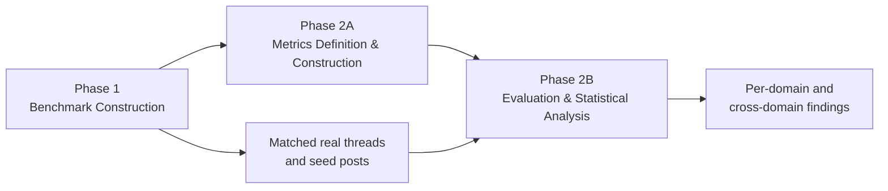

# MiroBench Pipeline Overview

## 1. Purpose and scope

MiroBench is a multi-domain benchmark for evaluating how closely simulated
Reddit discussions reproduce real discussion behavior. The benchmark is built
at the **thread level**: a real Reddit root post is selected as a seed, a
simulation system generates a discussion from that seed, and the generated
thread is compared with a matched real-reference thread using the same metric
definitions.

The pipeline has three parts:



The benchmark unit is defined as follows:

```text
1 seed = 1 selected real Reddit root post
1 generated thread = that seed post + zero or more generated comments
```

Therefore, for a completed matched-seed experiment, the number of seeds and
the number of generated threads should normally be identical. A thread with
zero comments is still a valid thread consisting only of its root post.

---

## 2. Phase 1: Benchmark Construction

### 2.1 Data collection

Reddit posts and comments are collected by domain-specific crawlers. The raw
landing zone preserves the source response for reproducibility, while all
benchmark-ready and publicly shared data must be produced as a separate,
sanitized derivative.

The collection and preparation flow is:

```text
Crawler output
  → schema normalization
  → deduplication
  → desensitization
  → content and quality filtering
  → domain validation
  → deterministic seed selection
  → matched real-reference construction
```

Each normalized thread contains:

- one root post, including title and body;
- zero or more comments;
- reply-tree structure through parent identifiers;
- benchmark metadata required for matching and evaluation, such as domain,
  source IDs, and relative comment depth.

### 2.2 Operational definitions of the four preparation stages

The terms **normalized**, **deduplicated**, **desensitized**, and
**quality-filtered** refer to different operations. They are not interchangeable
and none of them means that a record has been manually verified as true.

| Term | Operational meaning in MiroBench | What the term does **not** mean |
|---|---|---|
| **Normalized** | Source-specific fields are mapped to one thread schema; Reddit parent identifiers are converted into one reply tree; text encoding and missing-value representations are made consistent. | Metric values are not statistically normalized, and post/comment wording is not rewritten. |
| **Deduplicated** | Exact repeated roots and comments are identified by stable source IDs within a domain and retained once in the frozen benchmark. | Semantic near-duplicates, cross-posts with different IDs, and paraphrases are not automatically merged. |
| **Desensitized** | Direct username fields are replaced with opaque pseudonyms, deleted users retain a deletion marker, explicit Reddit user mentions are masked, and local machine paths are removed. | This is not a guarantee that every person, place, link, or indirect identifier has been removed from free text. |
| **Quality-filtered** | Records must satisfy explicit machine-checkable requirements for schema validity, usable root content, comment availability, and metric eligibility. | It is not a subjective judgment that a discussion is high quality, correct, civil, or representative. |

#### 2.2.1 Normalized

The normalized benchmark representation uses the following contract:

- a root post has `source_raw_post_id`, domain metadata, `title`, `body`, and
  `content`, where `content` is the non-empty combination of title and body;
- a comment has `comment_id`, `parent_comment_id`, `author`, `content`,
  timestamp/score metadata when available, and a recursively nested `replies`
  list;
- Reddit `t1_<id>` parent identifiers are converted to comment IDs, while a
  `t3_<post_id>` parent becomes a top-level comment with no parent comment;
- comments whose referenced parent is unavailable are retained as roots of
  the available comment forest instead of inventing a missing comment;
- top-level comments use depth 0 in the stored `discussion.json`; metric code
  derives its own documented depth convention from the parent graph;
- domain labels, run indices, post slots, and seed indices use the same schema
  for real references, OASIS, and SynthPAI.

Normalization is structural. Apart from Unicode/whitespace handling required
by a metric loader, it does not paraphrase Reddit text or alter its meaning.

#### 2.2.2 Deduplicated

Deduplication uses identifiers rather than text similarity:

- root-post key: `(domain, source_raw_post_id)`;
- comment key: `(domain, source_raw_post_id, comment_id)`;
- duplicate keys are retained once before the benchmark is frozen;
- the legacy `credit_cards` importer explicitly merges repeated comment rows
  by `comment_id` and normalizes their parent links before tree construction;
- the final portable bundle is audited for unique root and comment IDs within
  every domain.

The current frozen bundle contains 1,800 unique selected root IDs (150 in each
of 12 domains) and 35,551 retained comments with unique comment IDs within
each domain. This exact-ID rule does not detect two different Reddit IDs
containing the same article, copied text, or equivalent questions.

#### 2.2.3 Desensitized

The committed portable-input bundle currently applies these transformations:

| Source value | Current portable representation |
|---|---|
| Non-deleted Reddit `author` | `reddit_user_<12 hex characters>` derived deterministically from `SHA256(domain:username)` |
| Empty or deleted account | `[deleted]` |
| Free-text `/u/name` or `u/name` mention | `[REDDIT_USER]` |
| Local absolute paths in seed metadata/manifests | Removed |

The same source username maps consistently within a domain, while including
the domain in the hash avoids intentionally linking an identity across
domains. The raw local crawl retains original provenance and must not be
treated as desensitized data. OASIS/SynthPAI identities belong to generated
outputs rather than the real-data desensitization process and must be labeled
as synthetic identities.

The current transformation has important limits:

- it is a plain deterministic hash, not a secret-keyed HMAC;
- original Reddit post/comment IDs remain as provenance identifiers;
- the 11 new-domain seed records currently retain source permalinks;
- arbitrary names, locations, contact details, and indirect identifiers inside
  free text are not removed by a general named-entity or PII detector.

Consequently, **desensitized** in the current pipeline means
*username-desensitized for controlled benchmark use*, not fully anonymized or
irreversibly de-identified. A public data release requires a separate privacy
review, removal or controlled access for source links/IDs, free-text PII
screening, and preferably secret-keyed pseudonyms whose key is never released.

#### 2.2.4 Quality-filtered

Quality filtering occurs at two distinct points:

1. **Construction-time eligibility** determines whether a root can enter the
   fixed seed pool.
2. **Metric-time eligibility** determines which retained comments or pairs can
   contribute to a particular metric.

Current construction-time rules are:

- a root must have a non-empty title/body-derived `content` value and a stable
  source post ID;
- every JSONL input line must parse as a JSON object; malformed JSON aborts the
  build instead of being silently accepted, and roots without an ID or usable
  content are ineligible;
- each of the 11 newly collected domains requires at least one fetched comment
  before a root is eligible, after which 150 roots are sampled
  deterministically with seed `20260828`;
- the legacy `credit_cards` pool follows its earlier fixed ordering: the first
  150 of 154 stored seeds are used, 146 have captured comments, and four have
  zero captured comments;
- unavailable parents do not cause an otherwise usable comment to be dropped;
  the available reply forest is preserved.

Current metric-time rules include:

- empty, `[deleted]`, and `[removed]` text is converted to an unusable/empty
  metric input;
- the shared comment loader requires at least two whitespace-delimited tokens
  for a comment to enter most text and structure scorers;
- hard disagreement requires a parent of at least three tokens and a reply of
  at least two tokens;
- pairwise Uniformity metrics require at least two eligible comments, and
  coverage is reported when a thread has too few comments or pairs.

The frozen `discussion.json` references may still retain `[deleted]`,
`[removed]`, short comments, moderator boilerplate, or bot-like content for
provenance; metric loaders exclude only according to their declared rules.
There is currently no benchmark-wide semantic spam classifier, factuality
filter, toxicity filter, or comprehensive safety/PII filter. These must not be
claimed as completed quality-filtering steps unless their implementation,
thresholds, and removal counts are added to the manifest.

The implementation anchors for these definitions are:

- normalization and new-domain eligibility:
  `experiments/reddit_multidomain_baselines/scripts/build_seed_pools.py`;
- legacy credit-card normalization/deduplication:
  `experiments/reddit_multidomain_baselines/scripts/import_legacy_credit_cards.py`;
- username desensitization and portable manifests:
  `experiments/reddit_multidomain_baselines/scripts/package_portable_inputs.py`;
- metric-time comment filtering:
  `scripts/evaluation/score_thread_semantic_uniformity.py` and
  `scripts/evaluation/score_thread_disagreement.py`.

### 2.3 Domain selection

The current benchmark contains 12 domains:

1. `credit_cards`
2. `camera`
3. `celebrity`
4. `cellphone`
5. `game`
6. `headphones`
7. `health_issue`
8. `laptop`
9. `movies`
10. `news`
11. `sports`
12. `tv_series`

Domains are retained when they have sufficient usable root posts, sufficient
comment coverage, interpretable domain boundaries, and enough data to support
the same target sample size. Domain membership is stored as metadata; it is
not an additional experimental control condition.

### 2.4 Current data scale

The table below reports the current benchmark-construction inventory. A
**comment-eligible thread** is a usable real root thread with at least one
fetched real comment. A **benchmark seed** is a selected root post; every
selected seed is expected to yield one generated thread per evaluated system.

| Domain | Crawled records | Usable root threads | Comment-eligible threads | Benchmark seeds | Target generated threads/system |
|---|---:|---:|---:|---:|---:|
| `credit_cards` | 984 | 960 | 919 | 150 | 150 |
| `camera` | 700 | 700 | 496 | 150 | 150 |
| `celebrity` | 700 | 700 | 570 | 150 | 150 |
| `cellphone` | 700 | 700 | 413 | 150 | 150 |
| `game` | 700 | 700 | 563 | 150 | 150 |
| `headphones` | 700 | 700 | 616 | 150 | 150 |
| `health_issue` | 700 | 700 | 539 | 150 | 150 |
| `laptop` | 700 | 700 | 447 | 150 | 150 |
| `movies` | 700 | 700 | 532 | 150 | 150 |
| `news` | 700 | 700 | 474 | 150 | 150 |
| `sports` | 700 | 700 | 537 | 150 | 150 |
| `tv_series` | 700 | 700 | 460 | 150 | 150 |
| **Total** | **8,684** | **8,660** | **6,566** | **1,800** | **1,800** |

Credit-card counts above use the held-out test split used by the baseline
experiments. Its stored seed pool contains 154 seeds, created as an initial 54
plus 100 additional seeds, but the standardized benchmark uses the first 150.
The complete credit-card train-plus-test source contains 2,664 deduplicated,
usable real threads; it is not all used in the matched benchmark.

### 2.5 Seed selection and matched references

Seed selection must be deterministic and reproducible:

1. apply the documented domain-specific eligibility filter;
2. deduplicate by source post ID;
3. sample with a recorded random seed;
4. freeze the ordered list of selected seed indices;
5. use the same ordered seeds for every model and baseline;
6. construct a real-reference thread set from exactly those root posts;
7. record source counts, selected counts, filtering rules, and checksums in a
   manifest.

This matched design controls for root-topic variation: differences in the
evaluation are attributable to discussion generation rather than different
sets of prompts.

---

## 3. Phase 2A: Metrics Definition & Construction

### 3.1 Metric-selection principles

MiroBench defines four core metric families rather than treating every
individual metric as a separate family:

| Core metric family | Included metrics |
|---|---|
| **Structure** | Length, coefficient of variation (CV), average depth, and structural variability |
| **Uniformity** | Soft BLEU, Soft BERTScore, and semantic cosine |
| **Behavior** | Hard disagree rate, impolite rate, neutral rate, and polite rate |
| **Expression** | Mean story probability and emotion entropy |

Metrics are computed at the thread level first. Dataset-level summaries are
then derived from the distribution of thread-level scores. A higher score is
not universally better: the goal is closeness to the matched real distribution.

The scoring code may emit auxiliary diagnostic columns in addition to these
core metrics. Such columns are retained for debugging and exploratory analysis,
but they are not additional MiroBench metric families unless explicitly added
to the benchmark specification.

### 3.2 Metric definitions

Let a thread contain comments \(C = \{c_1, \ldots, c_n\}\), and let
\(P = \{(i,j): i < j\}\) be all unordered comment pairs.

#### 3.2.1 Structure

| Metric | Measurement and calculation | Interpretation |
|---|---|---|
| **Length** (`length_std`) | Count whitespace-delimited tokens in every comment and compute the population standard deviation of comment lengths within the thread. | Measures how much comment length varies within a discussion. |
| **CV** (`length_cv`) | Divide the standard deviation of comment length by mean comment length: \(CV=\sigma_L/\bar{L}\). | Measures relative length variation while adjusting for a thread's typical comment length. |
| **Average depth** (`avg_depth`) | Construct the parent–reply tree and compute comment depth by breadth-first search, with top-level comments at depth 1. Average the depths of all comments in the thread. | Higher values indicate deeper, more multi-level reply chains. |
| **Structural variability** (`structural_virality`) | Treat parent–reply links as an undirected graph and average the shortest-path distance over connected unordered comment pairs. | Distinguishes shallow or star-shaped conversations from discussions that spread through longer interaction paths. |

The conceptual name used in MiroBench is **structural variability**; the
current implementation and output schema retain the existing field name
`structural_virality`.

#### 3.2.2 Uniformity

| Metric | Measurement and calculation | Interpretation |
|---|---|---|
| **Soft BLEU** (`self_bleu_2`, `self_bleu_3`, `self_bleu_4`) | For each unordered comment pair, compute BLEU in both directions and average them: \(s_{ij}^{(k)}=[BLEU_k(c_i,c_j)+BLEU_k(c_j,c_i)]/2\). Average \(s_{ij}^{(k)}\) over all pairs for n-gram orders 2, 3, and 4. | Higher values indicate greater surface-form uniformity or repeated phrasing. |
| **Soft BERTScore** (`self_bertscore_mean_f1`) | Compute pairwise BERTScore F1 using `microsoft/deberta-xlarge-mnli`, with `roberta-large` fallback, and average F1 over all unordered comment pairs. | Higher values indicate greater contextual or token-level semantic uniformity. |
| **Semantic cosine** (`semantic_mean_cosine`) | Encode comments with `sentence-transformers/all-mpnet-base-v2`, normalize the embeddings, compute cosine similarity for each unordered pair, and take the mean. | Higher values indicate that comments are more semantically similar to one another. |

The current code uses the historical output names **Self-BLEU** and
**Self-BERTScore** for the benchmark concepts named **Soft BLEU** and
**Soft BERTScore** in this overview.

#### 3.2.3 Behavior

| Metric | Measurement and calculation | Interpretation |
|---|---|---|
| **Hard disagree rate** (`hard_disagree_rate`) | Extract parent-comment → reply-comment pairs, classify each pair with the local Stance_Rel RoBERTa model, and divide the number predicted as disagreement by the number of valid scored pairs. | Higher values indicate more explicit disagreement between replies and their parents. |
| **Impolite rate** (`impolite_rate`) | Classify every comment with `Intel/polite-guard` and compute `impolite_count / comment_count`. | Measures the share of comments classified as impolite. |
| **Neutral rate** (`neutral_rate`) | Compute `neutral_count / comment_count` from the politeness classifier. | Measures the share of comments classified as neutral in interaction tone. |
| **Polite rate** (`polite_rate`) | Compute `polite_count / comment_count` from the politeness classifier. | Measures the share of comments classified as polite. |

`somewhat_polite_rate` may still be emitted by the classifier, but it is an
auxiliary diagnostic rather than one of the four core Behavior metrics.

#### 3.2.4 Expression

| Metric | Measurement and calculation | Interpretation |
|---|---|---|
| **Mean story probability** (`mean_story_probability`) | Apply `mariaantoniak/storyseeker` to every comment and average the predicted probability that a comment contains a personal story. | Higher values indicate a stronger presence of personal experiences or narrative expression. |
| **Emotion entropy** (`emotion_entropy`) | Use `SamLowe/roberta-base-go_emotions` to assign dominant emotion labels, form the empirical label distribution \(p_e\), and compute Shannon entropy \(H=-\sum_e p_e\log p_e\). | Higher values indicate greater emotional diversity within the thread. |

Metrics requiring at least two comments, including Soft BLEU, Soft
BERTScore, and semantic cosine, return a documented neutral or empty value for
threads with insufficient pairs. Coverage counts must therefore be reported
alongside metric values.

### 3.3 Metric output contract

Every metric implementation should provide:

- one row per thread with `thread_id`, `comment_count`, and metric values;
- the number of valid comment pairs or scored comments;
- model/checkpoint name and version when a learned metric is used;
- device and fallback information;
- an explicit direction/interpretation note;
- deterministic settings where supported;
- a machine-readable JSON/CSV output and an execution log.

The current metric suite is orchestrated by
`scripts/evaluation/score_sampled_generated_runs.py` and the individual
`scripts/evaluation/score_thread_*.py` implementations.

---

## 4. Phase 2B: Evaluation & Statistical Analysis

### 4.1 Evaluation procedure

For each `(domain, baseline, model)` result with a successful generation
report:

1. load the frozen seed manifest;
2. verify expected seed/thread coverage;
3. score the matched real-reference threads once;
4. score the generated threads using the exact same metric implementations;
5. align real and generated outputs by metric schema;
6. retain one finite numeric value per valid thread and metric;
7. compare the real and generated thread-score distributions;
8. save per-job comparisons and a benchmark-level summary.

Already computed metric files are reused by default. `--force` explicitly
recomputes them. Failed generation jobs and dry runs are excluded from
evaluation.

The primary comparison object is:

```text
(domain, baseline, model, metric)
    real thread-score distribution
        versus
    generated thread-score distribution
```

### 4.2 Statistical analysis

For every selected core numeric metric, the evaluation reports:

| Statistical output | Definition | Purpose |
|---|---|---|
| `real_mean`, `generated_mean` | Arithmetic mean of valid thread scores in each group | Descriptive location |
| Mean difference | \(\bar{x}_{gen}-\bar{x}_{real}\) | Signed direction and magnitude |
| Wasserstein distance | First Wasserstein distance between empirical distributions | Overall distributional separation in metric units; lower is closer |
| KS statistic and p-value | Two-sample Kolmogorov–Smirnov test | Tests whether the two empirical distributions differ in location or shape |
| Mann–Whitney U and p-value | Two-sided rank-based test | Tests for systematic rank/location differences without assuming normality |
| Cliff's delta | \([\#(gen>real)-\#(gen<real)]/(n_{gen}n_{real})\) | Nonparametric signed effect size |

The null hypothesis for both the KS and Mann–Whitney tests is that there is no
distributional difference under the assumptions of the respective test. A
small p-value is evidence against the null; it is not the probability that the
null hypothesis is true and does not measure practical importance.

Statistical conclusions should always combine:

- sample sizes (`real_n`, `generated_n`);
- p-values;
- effect size such as Cliff's delta;
- distributional distance such as Wasserstein distance;
- descriptive means/medians and visualization of the score distributions.

As a reporting convention, absolute Cliff's delta may be labeled approximately
as negligible (`< 0.147`), small (`< 0.33`), medium (`< 0.474`), or large
(`>= 0.474`). These labels are interpretation aids, not thresholds implemented
by the current evaluator.

### 4.3 Multiple comparisons and cross-domain reporting

The current evaluator writes raw KS and Mann–Whitney p-values. Because the
benchmark compares many metrics, models, baselines, and domains, publication
analysis should additionally apply a declared multiple-testing correction,
such as Benjamini–Hochberg false discovery rate control, within a predeclared
family of hypotheses.

Results should be reported at two levels:

1. **Per-domain:** preserve domain-specific effects and failure modes.
2. **Cross-domain:** summarize effect sizes/distances across domains, reporting
   both macro averages and between-domain variability rather than pooling all
   threads as if domains were interchangeable.

Missing metrics and zero-comment threads must be reported as coverage, not
silently dropped. A system should not appear stronger merely because difficult
or empty threads failed to produce scores.

### 4.4 Reproducibility and artifacts

Generation accounting records elapsed time, estimated API cost, request/token
counts, generated runs, generated threads, and recursively counted comments.
Evaluation outputs retain per-thread scores and distribution comparisons.

For the multi-domain runner, the primary artifact layout is:

```text
artifacts/reddit_multidomain_baselines/
├── inputs/seed_pools/<domain>.json
├── inputs/real_reference/<domain>/
├── generation/<baseline>/<model>/<domain>/
│   ├── generated/
│   ├── token_usage.jsonl
│   └── generation_report.json
├── evaluation/<baseline>/<model>/<domain>/
│   ├── generated/revised_generated_thread_scores.csv
│   ├── metric_comparison.csv
│   └── evaluation_manifest.json
└── summary/
    ├── generation_summary.csv
    └── evaluation_summary.csv
```

An exact scoped evaluation can be run as:

```bash
./experiments/reddit_multidomain_baselines/run_evaluate_domain.sh camera \
  --models gpt-4o-mini \
  --baselines oasis \
  --device auto
```

The benchmark release should include frozen manifests, code revision, model and
checkpoint identifiers, metric configuration, random seeds, filtering counts,
privacy-audit status, and an explicit record of any deviations from the common
12-domain protocol.
